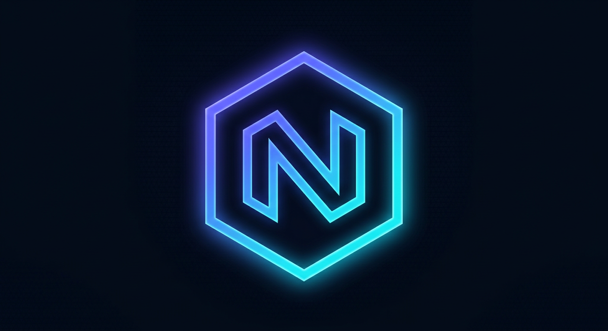

<div align="center">



# ⚡ Nexa

**پنل مدیریت کانکشن VLESS روی Cloudflare Workers**

پروکسی VLESS-over-WebSocket + پنل مدیریت فارسی + لینک اشتراک — همه در **یک ورکر رایگان**، بدون نیاز به سرور.


</div>

---

## ✨ امکانات

- 🔗 **پروکسی VLESS روی WebSocket** با پشتیبانی از early-data (0-RTT) — سازگار با v2rayNG، Hiddify، Streisand، NekoBox، sing-box و Clash Meta
- 🎛 **پنل مدیریت فارسی (RTL)** با ورود رمز عبور — طراحی مدرن، بدون هیچ CDN یا وابستگی خارجی
- 🤖 **ربات تلگرامی داخلی** — کاربرها مستقیم از تلگرام وارد می‌شوند، لینک اختصاصی + QR می‌گیرند و کل پنل را مدیریت می‌کنند (بدون سرور اضافه، داخل همین ورکر)
- 👥 **مدیریت چند کاربر** با UUID اختصاصی + **سقف حجم** و **تاریخ انقضا** و ردیابی مصرف (نیاز به KV)
- 📱 **لینک اشتراک** در سه فرمت: v2ray (base64) / Clash Meta (yaml) / sing-box (json)
- 🧹 **لینک‌های IP تمیز** به‌صورت خودکار برای هر کاربر + قابل ویرایش از پنل
- 📊 **نمایش QR** هر کانکشن و لینک اشتراک — با انکودر QR اختصاصی پروژه (بدون CDN)
- 🌐 **ProxyIP** برای عبور از سایت‌هایی که خودشان پشت کلادفلر هستند
- 🛡 بدون لاگ، بدون پایگاه‌داده بیرونی، بدون ارسال داده به شخص ثالث — همه‌چیز داخل ورکر شما

## 🚀 نصب

### روش ۱: دکمه دیپلوی (ساده‌ترین)

[](https://deploy.workers.cloudflare.com/?url=https://github.com/Nexa-zak/Nexa)

بعد از دیپلوی، در تنظیمات ورکر متغیرها را تنظیم کنید (پایین را ببینید) و `https://<your-worker>.workers.dev` را باز کنید.

### روش ۲: دستی با wrangler

```bash
git clone https://github.com/Nexa-zak/Nexa.git
cd Nexa
npm install

# فایل متغیرهای محلی بسازید:
cp .dev.vars.example .dev.vars   # و مقادیر را پر کنید

npx wrangler dev                 # اجرای محلی روی http://localhost:8787
npx wrangler deploy              # دیپلوی
```

### روش ۳: کپی در داشبورد

محتوای `src/worker.js` را در یک Worker جدید در داشبورد Cloudflare پیست کنید (فرمت **Module**)، ذخیره و دیپلوی کنید.

## 🔑 متغیرها (Settings → Variables)

| متغیر | ضروری | توضیح |
|---|---|---|
| `PASSWORD` | ✔️ | رمز ورود به پنل — **پیش‌فرض `nexa` است و حتماً عوضش کنید** |
| `UUID` | — | UUID کاربر اصلی در حالت بدون KV (نمونه: `npx wrangler secret put UUID` یا از تنظیمات) |
| `PROXYIP` | — | برای سایت‌های پشت کلادفلر (مثل `1.2.3.4` یا `1.2.3.4:443`) |
| `WS_PATH` | — | مسیر وب‌سوکت — پیش‌فرض `/ws` |
| `TELEGRAM_BOT_TOKEN` | — | توکن ربات از [@BotFather](https://t.me/BotFather) — با تنظیم آن، ربات تلگرام فعال می‌شود |

> در حالت **بدون KV** فقط یک کاربر دارید (UUID از متغیر بالا) و تنظیمات از طریق پنل ذخیره نمی‌شود.

### فعال‌سازی KV (پیشنهادی — برای مدیریت کاربران)

1. در داشبورد کلادفلر: **Workers & Pages → KV → Create namespace** (مثلاً `nexa-kv`)
2. در تنظیمات ورکر، **Bindings → Add → KV Namespace** اضافه کنید با نام متغیر `KV`
3. یا در `wrangler.toml`:

```toml
[[kv_namespaces]]
binding = "KV"
id = "<your-kv-namespace-id>"
```

حالا از تب «کاربران» می‌توانید بی‌نهایت کاربر با سقف حجم و انقضا بسازید و مصرف هر کاربر را ببینید.

## 📡 مسیرها

| مسیر | توضیح |
|---|---|
| `/` | پنل مدیریت (ورود با `PASSWORD`) |
| `/ws` | اتصال VLESS (وب‌سوکت) |
| `/sub/<token>` | لینک اشتراک v2ray |
| `/sub/<token>?format=clash` | لینک اشتراک Clash Meta |
| `/sub/<token>?format=singbox` | لینک اشتراک sing-box |
| `/tg/<secret>` | وب‌هوک ربات تلگرام (محرمانه) |
| `/healthz` | بررسی سلامت |

توکن اشتراک بعد از اولین اجرا ساخته می‌شود و از تب تنظیمات پنل قابل بازیابی/بازتولید است.

## 🤖 ربات تلگرام

Nexa یک ربات تلگرام **داخلی** دارد — همان ورکر هم پنل وب است و هم ربات؛ نیازی به سرور، Node.js یا سرویس اضافه نیست.

### راه‌اندازی (۳ دقیقه)

1. در تلگرام به [@BotFather](https://t.me/BotFather) پیام بدهید: `/newbot` → نام و یوزرنیم انتخاب کنید → **توکن** را کپی کنید
2. در تنظیمات ورکر (Settings → Variables) متغیر `TELEGRAM_BOT_TOKEN` را با این توکن بسازید
3. در پنل Nexa → تب **تنظیمات** → کارت «🤖 ربات تلگرام» → دکمه **«🔌 اتصال ربات به تلگرام»** — وب‌هوک و دستورات به‌صورت خودکار تنظیم می‌شوند
4. در تلگرام ربات خود را `/start` کنید و **رمز همان پنل** را بفرستید — تمام! 🎉

### چه کارهایی می‌شود کرد؟

| کار | روش |
|---|---|
| گرفتن کانکشن اختصاصی خودم | `/links` یا دکمه «کانکشن‌های من» — برای هر کاربر تلگرام، به‌صورت خودکار یک کاربر پنل ساخته می‌شود |
| دریافت QR هر کانکشن | دکمه 📷 کنار هر کانکشن — QR داخل خود ورکر رندر می‌شود |
| لینک اشتراک | `/sub` — سه فرمت v2ray / Clash / sing-box با QR |
| وضعیت و مصرف من | `/status` |
| مدیریت کاربران | `/users` و `/add` — افزودن کاربر با حجم و انقضا، حذف، بازتولید توکن |
| تنظیمات | `/proxyip` و `/ips` |
| QR هر لینکی | متن لینک `vless://` یا لینک اشتراک را مستقیم بفرستید |

> 🛡 امنیت: ورود با رمز پنل انجام می‌شود؛ ۵ تلاش ناموفق = ۱۰ دقیقه قفل. نشست ۳۰ روزه است و با `/logout` یا تغییر رمز پنل باطل می‌شود. هر کس رمز پنل را داشته باشد مدیر است.

## 🧪 تست‌ها

کل پروژه به‌صورت خودکار تست می‌شود:

```bash
npm run test:qr     # تست round-trip انکودر QR با jsQR (۴۱ حالت)
npm run test:png    # تست خط QR→PNG→دیکد (۴ حالت)
npm run test:e2e    # تست تونل واقعی VLESS (HTTP / TLS / DNS / رد UUID نامعتبر)
npm run test:bot    # تست کامل ربات تلگرام با ماک API تلگرام (۱۷ مورد)
```

تست E2E یک کلاینت VLESS واقعی است: از داخل تونل به `example.com` وصل می‌شود، هندشیک TLS کامل انجام می‌شود و پاسخ HTTP را از داخل تونل بررسی می‌کند.

> نکته: هدر `sec-websocket-protocol` در `wrangler dev` لوکال حذف می‌شود؛ بنابراین early-data فقط روی ورکر دیپلویشده کار می‌کند (در پروداکشن تست شده است).

## 🔐 نکات امنیتی

- **رمز پیش‌فرض را عوض کنید** — تب تنظیمات → رمز عبور جدید (حداقل ۶ کاراکتر)
- UUID ها را مثل رمز نگه دارید؛ هر کس UUID را داشته باشد می‌تواند وصل شود
- لینک اشتراک را فقط به کاربرهای خودتان بدهید؛ از تب تنظیمات می‌توانید هر لحظه توکن را بازتولید کنید
- توصیه: برای ورکر، دامنه اختصاصی (Custom Domain) اضافه کنید — دامنه‌های `workers.dev` در برخی شبکه‌ها فیلتر شده‌اند
- پنل با کوکی `HttpOnly` + `SameSite` و مقایسه زمان-ثابت رمز محافظت می‌شود

## 🗺 چطور کار می‌کند؟

```
اپلیکیشن (v2rayNG / Hiddify / ...)
   │  VLESS over WebSocket (TLS توسط کلادفلر)
   ▼
Cloudflare Edge  ──►  Nexa Worker  ──►  connect() به مقصد
                        │
                        └─ KV: کاربران، تنظیمات، مصرف
```

ورکر هدر VLESS را می‌خواند، UUID را با لیست کاربران تطبیق می‌دهد (انقضا/حجم را چک می‌کند)، با API سوکت‌های Cloudflare به مقصد وصل می‌شود و بایت‌ها را دوطرفه رله می‌کند. برای DNS روی UDP، پرس‌وجو از طریق DNS-over-HTTPS پاسخ داده می‌شود.

## 🙏 سپاس

این پروژه با الهام از اکوسیستم متن‌باز ورکرهای پروکسی فارسی (از جمله [edgetunnel](https://github.com/cmliu/edgetunnel)، [nahan](https://github.com/itsyebekhe/nahan) و پروژه‌های مشابه) و برای رایگان‌ نگه‌داشتن دسترسی آزاد به اینترنت نوشته شده است — همه‌چیز پیاده‌سازی اختصاصی این ریپو است.

## 📄 لایسنس

[MIT](LICENSE) — استفاده، تغییر و انتشار آزاد است.

<div align="center">

**⭐ اگر به دردت خورد، ستاره یادت نره! ⭐**

</div>
